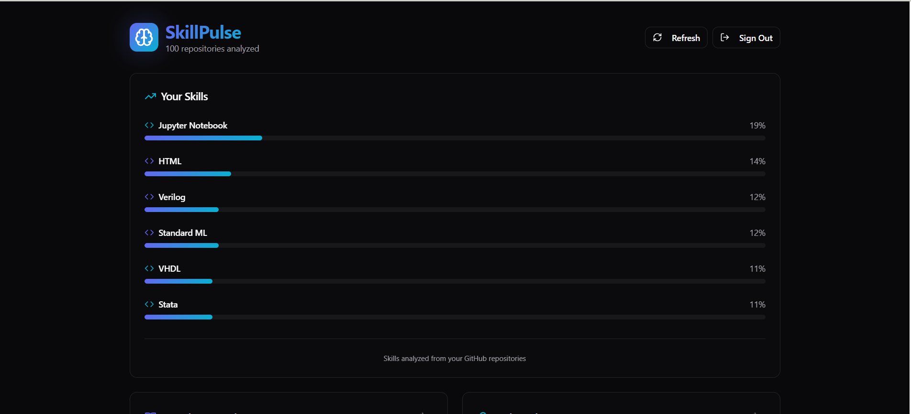
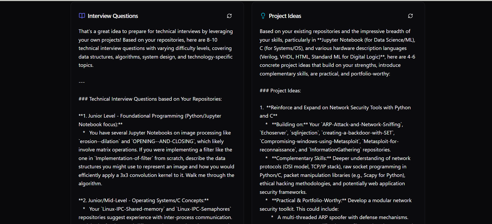
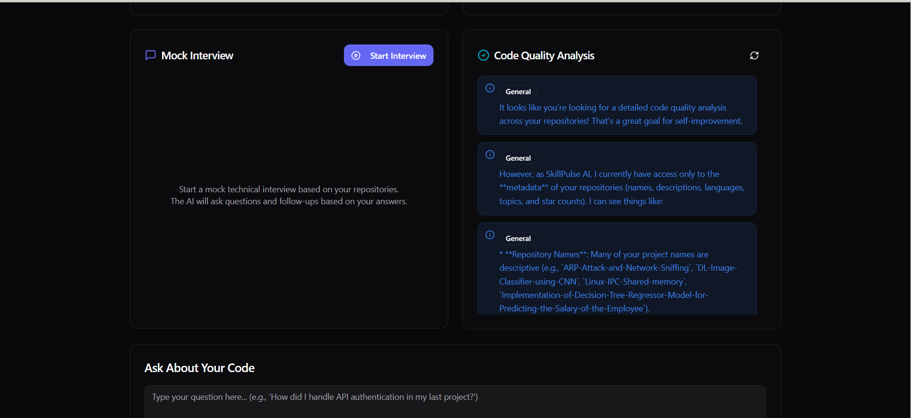

## SkillPulse : Intelligent Career Guardian
An AI platform that transforms GitHub from a static code repository into an interactive, personalized learning hub.
## About
SkillPulse is an AI platform that connects each of your projects into a dynamic skill graph, allowing you to visualize your technical growth, get tailored insights, and prepare for interviews using your own coding history. By analyzing how your skills evolve and linking related project experiences, SkillPulse makes your GitHub a true engine for continuouslearning and upskilling.

## Features
```
• Fetch and analyze GitHub repos
• Build dynamic skill graphs
• Use LLMs for project reasoning and interview prep
• Create an AI code memory for easy lookup
```
## Requirements
* Operating System: Requires a 64-bit OS (Windows 10/11 or Ubuntu 20.04+) for compatibility with Python, Node.js, and data analytics tools.
* Development Environment: Python 3.8 or later for backend analytics; Node.js (14+) for frontend/dashboard features.
* Machine Learning & Data Libraries: scikit-learn, Pandas, and TensorFlow for analytics and skill graph generation.
* Frontend Libraries: React.js and D3.js for interactive dashboards and visualization of skill graphs.
* Version Control: Git for collaborative coding and GitHub for project repository management and user login/data integration via OAuth.
* Database: MongoDB to store user profiles, skill analytics, and project history data.
* API Integration: GitHub API access is required for secure, user-authorized repository and commit data extraction.

## System Architecture

 

## Output

#### Output1 - Skill Analysis

#### Output2 - Questions and Project ideas

#### Output3 - Mock interview


## Results and Impact
SkillPulse transforms GitHub into an AI-driven personal learning brain, empowering developers to track their skill growth, generate project ideas, and prepare for interviews using their own code. By combining advanced AI with personalized insights, it fosters continuous learning, creativity, and career readiness. Aligned with key Sustainable Development Goals, SkillPulse  romotes inclusive education, innovation, and equitable opportunities, making it a valuable tool for developers seeking authentic growth in the evolving tech landscape.

## Articles published / References
1. GitHub API Documentation - For accessing and analyzing repository and commit history data.
2. Stack Overflow Developer Survey - For general developer tool and technology landscape insights.
3. Open Source Skills Reports / GitHub Annual Reports - For analyzing trends and technology adoption in open-source projects.
4. D3.js / Graph Visualization Documentation - Used for building interactive skill and project relationship visualizations


